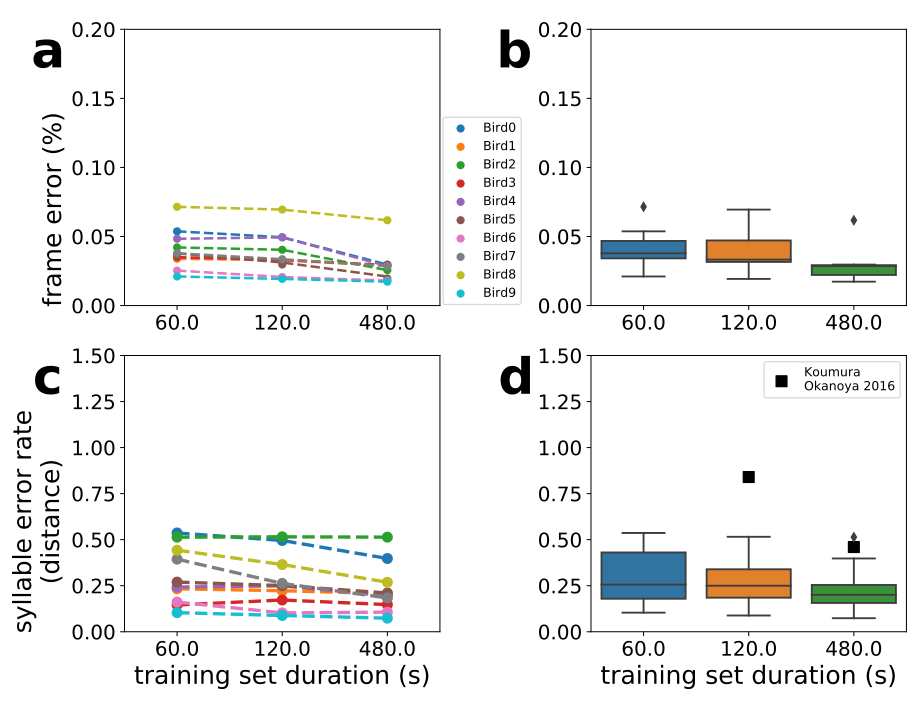

# TweetyNet

repository for the paper:  
"TweetyNet: A neural network that enables high-throughput, automated annotation of birdsong"  
https://www.biorxiv.org/content/10.1101/2020.08.28.272088v2

## What is `tweetynet`?
A neural network architecture, shown below:  

`tweetynet` automates annotation of birdsong and other vocalizations.  
An example of annotated song is shown below:  

## How is it used?
### Installation
To install, run the following command at the command line:  
`pip install tweetynet`

To facilitate training `tweetynet` models and using trained models 
to predict annotation on new datasets, 
we developed the `vak` library, 
that is installed automatically with `tweetynet`.

Please see the `vak` documentation for detailed installation instructions:  
https://vak.readthedocs.io/en/latest/get_started/installation.html  

### Usage
For a tutorial on using `tweetynet` with `vak`, please see the `vak` documentation:  
https://vak.readthedocs.io/en/latest/tutorial/autoannotate.html

### FAQs
#### Training data
To train models, you must supply training data in the form of audio files or 
spectrogram files, and annotations.
The package can generate spectrograms from `.wav` or `.cbin` audio files.
It can also accept spectrograms in the form of Matlab `.mat` files or `.npz` files created by `numpy`.
`vak` uses a separate library to parse annotations, `crowsetta`, 
which handles some common formats and can also be used to write custom parsers for other formats.
Please see the `crowsetta` documentation for more detail:  
https://crowsetta.readthedocs.io/en/latest/#

#### Preparing training files
It is possible to train on any manually annotated data but there are some useful guidelines:
* __Use as many examples as possible__ - The results will just be better. Specifically, this code will not label correctly syllables it did not encounter while training and will most probably generalize to the nearest sample or ignore the syllable.
* __Use noise examples__ - This will make the code very good in ignoring noise.
* __Examples of syllables on noise are important__ - It is a good practice to start with clean recordings. The code will not perform miracles and is most likely to fail if the audio is too corrupt or masked by noise. Still, training with examples of syllables on the background of cage noises will be beneficial.

For more details, please see the [vak documentation](https://github.com/NickleDave/vak).

## Issues
If you run into problems, please use the [issue tracker](https://github.com/yardencsGitHub/tweetynet/issues) 
or contact the authors via email in the paper above.

## Citation
If you use or adapt this code, please cite its DOI:  

## License
Released under [BSD license](./LICENSE).
